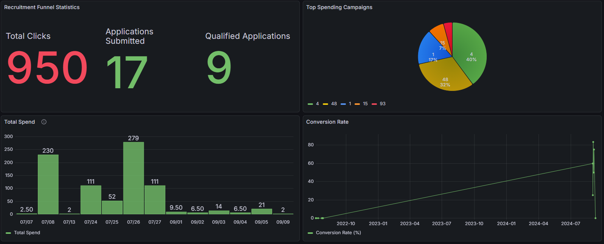

# Recruitment Data Pipeline & Analytics 🚀


An automated ETL pipeline that extracts, cleanses, and aggregates candidate behavioral tracking data from a Data Lake (Cassandra) into a Data Warehouse (MySQL) for real-time visualization on Grafana.

---

## 1. Overview

**The Problem:** 
In the recruitment domain, a candidate's journey involves significant time lags (e.g., clicking a job ad on Monday $\rightarrow$ submitting an application on Tuesday $\rightarrow$ being marked as "qualified" on Wednesday). This project solves the challenge of consolidating these scattered events across different timeframes to accurately calculate Ad Spend and Conversion Rates, helping Talent Acquisition teams optimize their marketing budgets.

**Key Use Cases:**
*   Ingest raw tracking data (clicks, conversions, etc.) via Batch/Micro-batch processing.
*   Execute automated Incremental ETL loads to process only newly generated data.
*   Build an interactive Recruitment Funnel Dashboard on Grafana.

---

## 2. Demo & Screenshots





---

## 3. Installation

This project is fully containerized using Docker. There is no need to install Spark or Databases locally on your host machine.

**Prerequisites:**
*   [Docker](https://www.docker.com/) & Docker Compose
*   Git

**Setup Steps:**

```bash
# 1. Clone the repository
git clone [https://github.com/your-username/recruitment-etl-pipeline.git](https://github.com/your-username/recruitment-etl-pipeline.git)
cd recruitment-etl-pipeline

# 2. Setup environment variables
cp Compose/.env.example Compose/.env
# (Open the .env file and fill in your passwords for MySQL and Grafana if necessary)

# 3. Spin up the infrastructure (Cassandra, MySQL, Spark, Grafana)
cd Compose
docker compose up -d
```

## 4. Usage

**Step 1: Initialize Database Schemas**
*   **Cassandra (Data Lake):** Run the queries in `SQL/Cassandra/tracking_raw.cql` via DataGrip or `cqlsh` to create the Keyspace and Raw Tables.
*   **MySQL (Data Warehouse):** Run the schema initialization scripts located in `SQL/MySQL/`.

**Step 2: Load Dummy Data (Optional)**
You can load the sample data from the `sample_data/` folder into Cassandra to test the pipeline flow.

**Step 3: Execute the PySpark ETL Pipeline**
Open your terminal and submit the Spark job inside the PySpark container:

```bash
docker exec -it recruitment_pyspark bash -c "/opt/spark/bin/spark-submit --conf spark.jars.ivy=/tmp/ivy --packages com.datastax.spark:spark-cassandra-connector_2.12:3.1.0,mysql:mysql-connector-java:8.0.33 /opt/spark/work-dir/etl.py"
```

*Expected Output:* The script will check the current MySQL checkpoint, compare it with Cassandra, log `New Data Found!`, perform the transformations, and append the aggregated data into the MySQL `events` table. This loop runs continuously (Micro-batch streaming) every 5 seconds.

---

## 5. Project Structure

```text
RECRUITMENT/
├── Compose/
│   ├── docker-compose.yml       # Infrastructure container configurations
│   └── .env.example             # Environment variables template
├── ETL/
│   └── Spark/
│       └── etl.py               # Core PySpark script for the Incremental ETL flow
├── SQL/
│   ├── Cassandra/               # CQL scripts for Keyspace and Raw tables
│   └── MySQL/                   # SQL scripts for Data Warehouse schema
├── Document/                    # Data Dictionary and architecture notes
├── sample_data/                 # (Optional) Dummy CSV data for testing
└── README.md                    # Project documentation
```

---

## 6. Tech Stack

*   **Programming Language:** Python 3.10
*   **Data Processing:** Apache Spark (PySpark) 3.5.1
*   **Data Lake:** Apache Cassandra 4.1
*   **Data Warehouse:** MySQL 8.0
*   **Data Visualization:** Grafana
*   **Infrastructure & Containerization:** Docker, Docker Compose

---

## 7. Technical Details

**Incremental Load Mechanism:**
*   The system maintains a state "Checkpoint" by querying `MAX(updated_at)` from the MySQL `events` table.
*   Only records in Cassandra with a timestamp (`ts`) strictly greater than this Checkpoint are extracted by PySpark, optimizing I/O performance.

**ETL Transformation Logic:**
*   **Cleansing:** Handles missing values (e.g., Null `bid` values) using `.na.fill(0)`.
*   **Aggregation:** Groups metrics (`click`, `conversion`, `qualified`) by hour (`ts`), `job_id`, and `campaign_id`.
*   **Full Outer Join:** Addresses the **"Late Arriving Events"** problem. By performing a Full Outer Join on the aggregated tables in memory, the pipeline ensures no candidate application data is lost, even if the user clicked the ad yesterday but submitted the application today.
*   **Enrichment:** Left joins with the `job` table to map the corresponding `company_id`.

## 8. Author / Contact
* Phat Tran
* Email: tranvinhphat02022001@gmail.com
* Github: https://github.com/tranvinhphat0202
